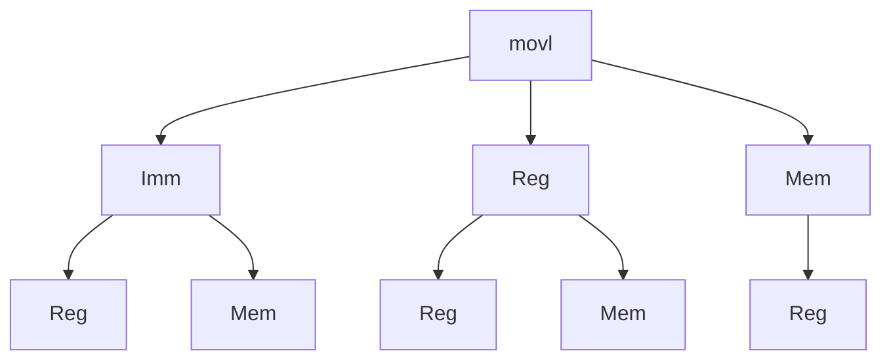

# C与汇编语言

## 汇编语言基础

### 汇编语言的数据格式

|     C声明     | Intel数据类型 | 汇编代码后缀 | 大小（字节） |
| :-----------: | :-----------: | :----------: | :----------: |
|     char      |     字节      |      b       |      1       |
|     short     |      字       |      w       |      2       |
|      int      |     双字      |      l       |      4       |
|   long int    |     双字      |      l       |      4       |
| long long int |       -       |      -       |      4       |
|    char *     |     双字      |      l       |      4       |
|     float     |    单精度     |      s       |      4       |
|    double     |    双精度     |      l       |      8       |
|  long double  |   扩展精度    |      t       |    10/12     |

> 在X86-32中，使用“字（word）”来表示16位整数类型，“双字”表示32位整数类型

## 第一条汇编指令

```c++
int t = x + y;
```

两个32位整数相加

+ l后缀表示双字运算
+ 无符号/带符号整数加法运算的指令是一样的

```assembly
addl 8(%ebp) %eax
```

操作数：

+ x：register  `eax`
+ y：memory  `M[ebp+8]`
+ t：register  `eax`
+ 结果存于eax

### 数据传送指令

数据传送指令（AT&T语法）

`movl Sorce,Dest`

+ 将一个“双字”从Sorce移到Dest

允许的操作数类型

+ 立即数：长整数，如：`$0x400`、`$-533`，可被1，2或4个字节来表示
+ 寄存器：8个通用寄存器之一
+ 存储器：四个连续字节

数据传送指令支持的不同操作数类型组合



不允许两个操作数都是内存地址

## 寻址模式

### 实例分析

```c++
void swap(int *xp, int *yp){
  	int t0 = *xp;
  	int t1 = *yp;
  	*xp = t1;
  	*yp = t2;
}
```

| Register | Variable |
| -------- | -------- |
| `%ecx`   | `yp`     |
| `%edx`   | `xp`     |
| `%eax`   | `t1`     |
| `%ebx`   | `t0`     |

```assembly
movl 12(%ebp), %ecx
movl 8(%ebp), %edx
movl (%ecx), %eax
movl (%edx), %ebx
movl %eax, (%edx)
movl %ebx, (%ecx)
```

### 变址寻址

常见形式

`D(Rb, Ri, S)	Mem[Reg[Rb]+S*Reg[Ri]+D]`

+ D：常量（地址偏移量）
+ Rb：基址寄存器：8个通用寄存器之一
+ Ri：索引寄存器；`%esp`不作为索引寄存器，一般`%ebp`也不用做这个用途
+ S：比例因子1，2，4 or 8

|    Expression     |     Computation      |  Address  |
| :---------------: | :------------------: | :-------: |
|    `0x8(%edx)`    |    `0xf000 + 0x8`    | `0xf008`  |
|  `(%edx, %ecx)`   |   `0xf000 + 0x100`   | `0xf100`  |
| `(%edx, %ecx, 4)` | `0xf000 + 4 * 0x100` | `0xf400`  |
|  `0x80(%edx, 2)`  | `2 * 0xf000 + 0x80`  | `0x1e080` |

### 地址计算指令

`leal Src,Dest`

+ `Src`是地址计算表达式
+ 计算出来的值赋给`Dest`

使用实例：

+ 地址计算（无需访存）
+ 进行$x+k*y$的整数计算

#### 整数计算指令

| Format           | Computation                        |
| :--------------- | :--------------------------------- |
| `addl Src,Dest`  | `Dest = Dest + Src`                |
| `subl Src,Dest`  | `Dest = Dest - Src`                |
| `imull Src,Dest` | `Dest = Dest * Src`                |
| `sall Src,Dest`  | `Dest = Dest << Src`（与shll等价） |
| `sarl Src,Dest`  | `Dest = Dest >> Src`（算数右移）   |
| `shrl Src,Dest`  | `Dest = Dest >> Src`（逻辑右移）   |
| `xorl Src,Dest`  | `Dest = Dest ^ Src`                |
| `andl Src,Dest`  | `Dest = Dest & Src`                |
| `orl Src,Dest`   | `Dest = Dest | Src`                |

#### 将leal指令用于计算

实例1：

```c++
int arith(int x, int y, int z){
  	int t1 = x + y;
  	int t2 = z + t1;
  	int t3 = x + 4;
  	int t4 = y * 48;
  	int t5 = t3 + t4;
  	int rval = t2 * t5;
  	return rval;
}
```

```assembly
movl 8(%ebp),%eax            # eax = x
movl 12($ebp),%edx           # edx = y
leal (%edx,%eax),%ecx        # ecx = x + y (t1)
leal (%edx, %edx, 2),%ecx    # edx = 3 * y 
sall $4,%edx                 # edx = 48 * y (t4)
addl 16(%ebp),%ecx           # ecx = z + t1 (t2)
leal 4(%edx,%eax),%eax       # eax = 4 + t4 + x (t5)
imull %ecx,%eax              # eax = t5 * t2 (rval)
```

实例2：

```c++
int logical(int x, int y){
	int t1 = x ^ y;
  int t2 = t1 >> 17;
  int maxk = (1 << 13) - 7;
  int rval = t2 & mask;
  return rval;
}
```

```assembly
movl 8(%ebp),%eax
xorl 12(%ebp),%eax
sarl $17,%eax
andl $8185,%eax
```

## Control Flow（控制流）

### 条件码

+ CF：Carry(进位) Flag
+ SF：Sign Flag
+ ZF：Zero Flag
+ OF：Overflow Flag

这些条件码由算术指令隐含设置

#### 加法指令

`addl Src,Dest`

t = a + b (a=Src, b=Dest)

+ CF 进位标志，可用于检测无符号整数运算的溢出
+ ZF set if $t == 0$
+ SF set if $t < 0$
+ OF set if 补码运算溢出（即带符号整数运算）
  + a > 0 && b > 0 && t < 0
  + a < 0 && b < 0 && t > 0

#### 比较指令

`cmpl Src2,Src1`

`cmpl b,a`与计算`a-b`类似

+ CF set if 向最高位借位，可用于无符号整数比较
+ ZF set if a == b
+ SF set if $a-b<0$
+ OF set if 
  + a > 0 && b < 0 && (a - b) < 0
  + a < 0 && b > 0 && (a - b) > 0

#### 测试指令

`testl Src2,Src1`

计算`Src1 & Src2`并设置相应的条件码

+ CF = 0
+ ZF set when a & b == 0
+ SF set when a & b < 0
+ OF = 0

#### 读取条件码

**SetX指令**

读取当前的条件码（或者某些条件码的组合），并存入目的字节寄存器

| SetX    | Condition                                                    | Description              |
| ------- | ------------------------------------------------------------ | ------------------------ |
| `sete`  | $\mathrm{ZF}$                                                | Equal/Zero               |
| `setne` | $\sim \mathrm{ZF}$                                           | Not Equal/Not Zero       |
| `sets`  | $\mathrm{SF}$                                                | Negative                 |
| `setns` | $\sim\mathrm{SF}$                                            | Nonnegative              |
| `setg`  | $\sim (\mathrm{SF} \mbox{^} \mathrm{OF}) \& \sim \mathrm{ZF}$ | Greater(signed)          |
| `setge` | $\sim (\mathrm{SF} \mbox{^} \mathrm{OF})$                    | Greater or Equal(signed) |
| `setl`  | $(\mathrm{SF} \mbox{^} \mathrm{OF})$                         | Less(signed)             |
| `setle` | $(\mathrm{SF} \mbox{^} \mathrm{OF})|\mathrm{ZF}$             | Less or Equal(signed)    |
| `seta`  | $\sim \mathrm{CF}\&\sim\mathrm{ZF}$                          | Above(unsigned)          |
| `setb`  | $\mathrm{CF}$                                                | Below(unsigned)          |

例：

```c++
int gt(int x, int y){
  return x > y;
}
```

```assembly
movl 12(%ebp),%eax   # eax = y
cmpl %eax,8(%ebp)    # Compare x : y
setg %al             # al = x > y
movzbl %al,%eax      # Zero rest of %eax
```

**jX指令（跳转指令）**

依赖于当前的条件码选择下一条执行语句（是否顺序执行）

| jX    | Condition                                               | Description              |
| ----- | ------------------------------------------------------- | ------------------------ |
| `jmp` | $1$                                                     | Unconditional            |
| `je`  | $\mathrm{ZF}$                                           | Equal/Zero               |
| `jne` | $\sim\mathrm{ZF}$                                       | Not Equal/Not Zero       |
| `js`  | $\mathrm{SF}$                                           | Negative                 |
| `jns` | $\sim\mathrm{SF}$                                       | Nonnegative              |
| `jg`  | $\sim(\mathrm{SF}\mbox{^}\mathrm{OF})\&\sim\mathrm{ZF}$ | Greater(Signed)          |
| `jge` | $\sim(\mathrm{SF}\mbox{^}\mathrm{OF})$                  | Greater or Equal(Signed) |
| `jl`  | $(\mathrm{SF}\mbox{^}\mathrm{OF})$                      | Less(Signed)             |
| `jle` | $(\mathrm{SF}\mbox{^}\mathrm{OF})|\mathrm{ZF}$          | Less or Equal(Signed)    |
| `ja`  | $\sim\mathrm{CF}\&\sim\mathrm{ZF}$                      | Above(unsigned)          |
| `jb`  | $\mathrm{CF}$                                           | Below(unsigned)          |

例：

```c++
ind absdiff(int x, int y){
  int result;
  if(x > y){
    result = x - y;
  }else{
    result = y - x;
  }
  return result;
}
```

```assembly
absdiff:
	pushl %ebp
	movl %esp,%ebp
	movl 8(%ebp),%edx
	movl 12(%ebp),%edx
	cmpl $eax,%edx
	jle .L7
	subl %eax,%edx
	movl %edx,%eax
.L8:
	leave
	ret
.L7:
	subl %edx,%eax
	jmp L8
```

### 循环

所有的循环模式（while, do-while, for）都转换为“do-while”形式，再转换为汇编形式

原始C代码：

```c++
int fact_do(int x){
  int result = q;
  do{
    result *= x;
    x = x - 1;
  } while (x > 1);
  return result;
}
```

编译器先转换为goto模式

```c++
int fact_goto(int x){
  int result = 1;
loop:
  result *= x;
  x = x - 1;
  if (x > 1)
    goto loop;
  return result;
}
```

汇编：

```assembly
fact_goto:
	pushl %ebp          # Setup
	movl %esp,%ebp		  # Setup
	movl $1,%eax				# eax = 1
	movl 8(%ebp),$edx   # edx = 1
L11:
	imull %edx,%eax			# result *= x
	decl %edx						# x --
	cmpl $1,%edx 				# Compare x : 1
	jg L11							# if > goto loop
	
	movl %ebp,%esp			# Finish
	popl %ebp						# Finish
	ret									# Finish
```

#### while循环

while循环常常转换成do-while循环来做

```c++
//原始的C代码
int fact_while(int x){
	int result = 1;
  while (x > 1){
    result *= x;
    x = x - 1;
  }
  return result
}

//Goto Version
int fact_while_goto(int x){
  int result = 1;
  if (!(x > 1))
    goto done;
loop:
  result *= x;
  x = x - 1;
  if (x > 1)
    goto loop;
done:
  return result;
}
```

#### for循环

For $\rightarrow$ While $\rightarrow$ Do-While

For version: 

```c++
for (init; Test; Update)
  Body
```

While version:

```c++
init;
while(Test){
  Body;
  Update;
}
```

Do-While version:

```c++
init;
if(!Test)
  goto done;
do{
  Body;
  Update;
} while (Test)
done:
```

### switch语句

#### 跳转表

Switch Form

```c++
switch(x){
  case val_0:
    Block_0;
  case val_1:
    Block_1;
  ......
  case val_n-1:
    Block_n-1;
}
```

把各个Block的入口地址存到跳转表中

## x86-64的程序栈

+ 符合栈工作原理的一块内存区域
  + 从高地址向低地址增长
+ `%esp`存储栈顶地址

压栈操作：`pushl Src`

+ 从Src取得操作数
+ %esp = %esp - 4
+ 写入栈顶地址（%esp）

出栈操作：`popl Dest`

+ 读取栈顶数据（%esp）
+ %esp = %esp + 4
+ 写入dest

### 过程调用

过程调用指令：

+ `call label`将返回地址压入栈，跳转至label

返回地址：

+ call指令的下一条指令地址

+ 汇编实例

  ```assembly
  804854e: e8 3d 06 00 00 call 8048b90 <main>
  8048553: 50             pushl %eax
  ```

  Return address = 0x80486553

过程返回指令：

+ ret  跳转至栈顶的返回地址

#### 基于栈的编程语言

+ 支持递归
  + 代码是可重入的（Reentrant）
    + 同时有同一个过程的多个实例在运行
  + 因此需要有一块区域来储存每个过程实例的数据
    + 参数
    + 局部变量
    + 返回地址
+ 栈的工作规律
  + 每个过程实例的运行时间是有限的，即栈的有效时间有限
  + 被调用者先于调用者返回（一般情况下）
+ 每个过程实例在栈中维护一个栈帧（stack frame）

#### 栈帧

储存的内容

+ 局部变量
+ 返回地址
+ 临时空间

栈帧的分配与释放

+ 进入过程后先“分配”栈帧空间
+ 过程返回时“释放”
+ 寄存器%ebp指向当前栈帧的起始地址

#### 寄存器使用惯例

将通用寄存器分为两类：

+ 调用者负责保存
  + caller在调用子过程之前将这些寄存器内容储存在它的栈帧内
+ 被调用者负责保存
  + callee在使用这些寄存器之前将其原有内容储存在它的栈帧内

